# InfloWave - 开发文档索引

## 📚 文档导航

本项目采用 **Tauri + React + TypeScript** 混合开发架构，为时序数据库提供现代化的图形界面管理工具。

### 🏗️ 架构概览

```
┌─────────────────┐    ┌─────────────────┐    ┌─────────────────┐
│   React 前端    │◄──►│   Tauri 桥接    │◄──►│   Rust 后端     │
│                 │    │                 │    │                 │
│ • TypeScript    │    │ • IPC 通信      │    │ • InfluxDB 连接 │
│ • Ant Design    │    │ • 命令处理      │    │ • 数据处理      │
│ • Zustand       │    │ • 事件系统      │    │ • 安全管理      │
│ • ECharts       │    │                 │    │                 │
└─────────────────┘    └─────────────────┘    └─────────────────┘
```

## 📖 开发文档分类

### 🦀 [后端开发](./backend/README.md)
Rust + Tauri 后端开发相关文档

- **[环境配置](./backend/environment.md)** - PowerShell + Scoop 环境设置
- **[架构设计](./architecture.md)** - 系统架构和模块设计
- **[API 开发](./backend/api.md)** - Tauri 命令开发指南
- **[部署指南](./deployment.md)** - 跨平台构建和部署
- **[数据库操作](./backend/database.md)** - InfluxDB 1.0 连接和操作
- **[安全管理](./backend/security.md)** - 连接凭据和数据安全
- **[测试调试](./backend/testing.md)** - 后端测试和调试技巧
- **[性能优化](./backend/performance.md)** - 后端性能优化策略

### ⚛️ [前端开发](./frontend/README.md)
React + TypeScript 前端开发相关文档

- **[环境配置](./frontend/environment.md)** - Node.js 和前端工具链
- **[组件开发](./frontend/components.md)** - React 组件开发规范
- **[状态管理](./frontend/state.md)** - Zustand 状态管理模式
- **[UI 设计](./frontend/ui-design.md)** - Ant Design 使用规范
- **[数据可视化](./frontend/visualization.md)** - ECharts 图表开发
- **[路由管理](./frontend/routing.md)** - React Router 配置
- **[测试开发](./frontend/testing.md)** - 前端测试策略
- **[样式管理](./frontend/styling.md)** - TailwindCSS 样式规范

### 🔗 [集成对接](./integration/README.md)
前后端集成和外部系统对接文档

- **[通信协议](./integration/communication.md)** - 前后端 IPC 通信
- **[InfluxDB 对接](./integration/influxdb.md)** - InfluxDB 1.0 兼容性
- **[数据流设计](./integration/data-flow.md)** - 数据处理流程
- **[错误处理](./integration/error-handling.md)** - 统一错误处理机制
- **[配置管理](./integration/configuration.md)** - 应用配置和设置
- **[插件系统](./integration/plugins.md)** - 扩展插件开发

## 🚀 快速开始

### 环境要求
- **操作系统**: Windows 10+ (推荐使用 PowerShell)
- **包管理器**: Scoop (用于安装 Rust 工具链)
- **Node.js**: 18.0+
- **Rust**: 1.70+ (通过 Scoop 安装)

### 一键启动开发环境
```powershell
# 克隆项目
git clone <repository-url>
cd inflowave

# 运行开发环境设置脚本
.\scripts\setup-dev.ps1

# 启动开发服务器
npm run tauri:dev
```

## 📋 开发工作流

### 1. 功能开发流程

```mermaid
graph LR
    A[需求分析] --> B[架构设计]
    B --> C[后端API开发]
    C --> D[前端界面开发]
    D --> E[集成测试]
    E --> F[文档更新]
    F --> G[代码审查]
    G --> H[部署发布]
```


### 2. 分支管理策略
- `main` - 主分支，稳定版本
- `develop` - 开发分支，功能集成
- `feature/*` - 功能分支
- `hotfix/*` - 紧急修复分支

### 3. 提交规范
```
type(scope): description

类型:
- feat: 新功能
- fix: 修复
- docs: 文档
- style: 格式
- refactor: 重构
- test: 测试
- chore: 构建工具
```

## 🔧 开发工具推荐

### PowerShell 工具
- **Scoop**: 包管理器
- **Windows Terminal**: 现代终端
- **PowerShell 7**: 最新 PowerShell 版本

### 开发环境
- **VS Code**: 主要编辑器
- **Rust Analyzer**: Rust 语言服务
- **ES7+ React/Redux/React-Native snippets**: React 代码片段
- **Tauri**: Tauri 开发工具

### 调试工具
- **Chrome DevTools**: 前端调试
- **Rust Debugger**: 后端调试
- **Tauri DevTools**: 应用调试

## 📊 项目统计

### 技术栈分布
- **前端**: React 18 + TypeScript + Ant Design + TailwindCSS
- **后端**: Rust + Tauri 2.0 + Tokio
- **数据库**: InfluxDB 1.0 客户端
- **构建工具**: Vite + Cargo
- **测试框架**: Vitest + Rust 内置测试

### 代码结构
```
项目根目录/
├── src/                    # 前端源码
├── src-tauri/             # 后端源码
├── dev-docs/              # 开发文档
├── user-docs/             # 用户文档
├── scripts/               # 构建脚本
└── docs/                  # 原有文档 (待迁移)
```

## 🤝 贡献指南

1. **Fork 项目** 到个人仓库
2. **创建功能分支** 进行开发
3. **遵循代码规范** 和文档要求
4. **编写测试用例** 确保代码质量
5. **提交 Pull Request** 等待审查

## 📞 获取帮助

- **技术问题**: 查看对应模块的详细文档
- **Bug 报告**: 提交 GitHub Issue
- **功能建议**: 参与 GitHub Discussions
- **开发交流**: 加入开发者群组

---

> 💡 **提示**: 建议按照 `后端 → 前端 → 集成` 的顺序阅读文档，这样能更好地理解整个系统的架构设计。
